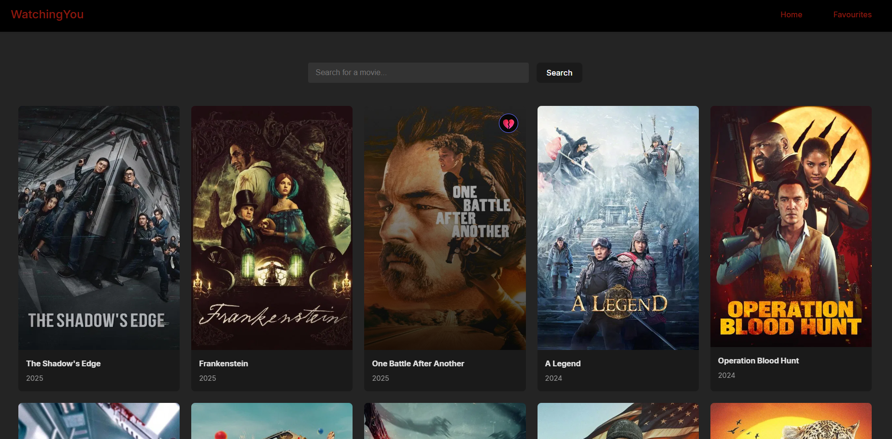
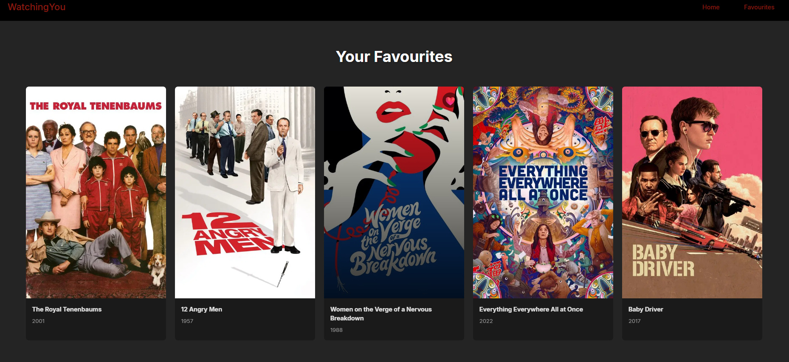

# WatchingYou
A React + Vite application for browsing, searching, and saving movies. The project integrates with the TMDB API and uses the Context API for global state management.

## How It's Made:
Tech used: `HTML, CSS, React, Vite, JavaScript, TMDB API`

The application retrieves movie data from the TMDB API and displays popular movies on the Home page. React state is used to manage dynamic data such as the movie list, search results, and loading status. 

Favourited movies persist across page navigation by storing them in localStorage.
- A React Context is used to manage the favourites list across the entire app. The `MovieContext` component stores the favourites in state, loads any saved favourites from localStorage on startup, and keeps localStorage updated whenever the list changes. It also provides helper functions to add a movie, remove a movie, and check whether a movie is already in the favourites. 

## Current Problems
- The movie poster scales incorrectly when only one favourite is shown, stretching to fill the entire screen instead of maintaining a consistent size. The same problem occurs with searching movies.
- Favourites are lost on page refresh.

## Future Enhancements
- Implement a backend to securely handle API requests
- Login / user authentication
- Save favourites so they persist after closing browser
- Ability to create watchlists
- Ability to add personal notes for each movie
