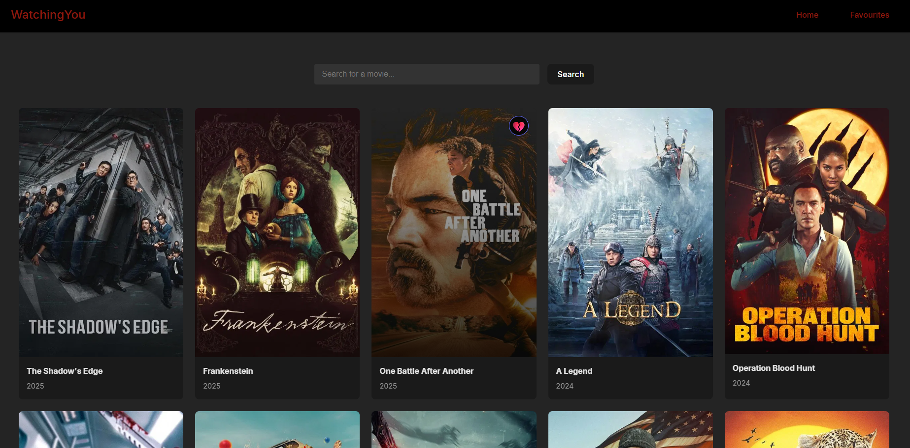
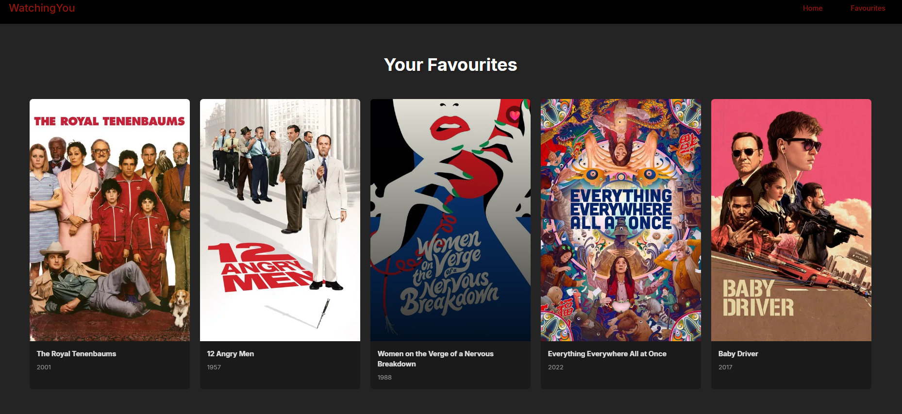
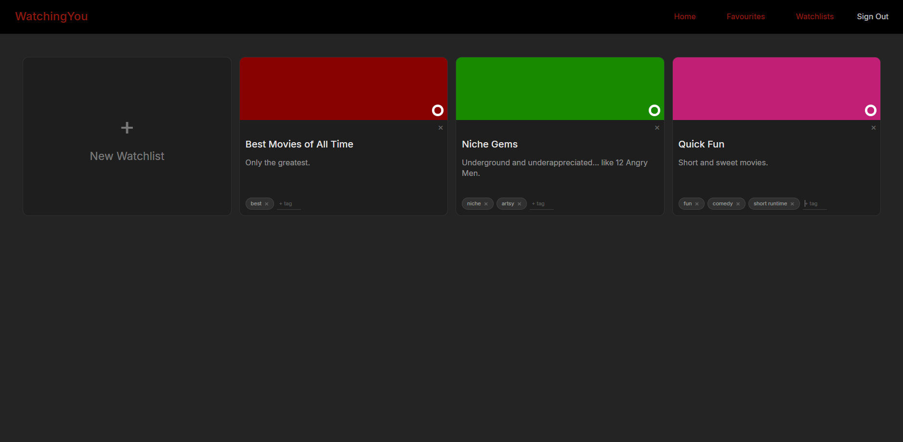
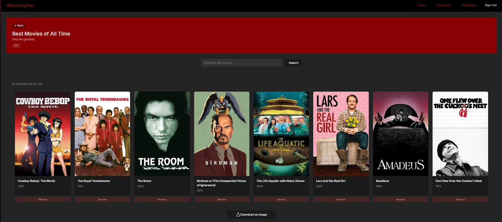

# WatchingYou
A React + Vite application for browsing, favouriting and managing your own movie watchlists, integrating with the TMDB API and Supabase.

## Overview
The application is deployed on Netlify. Go and make your first watchlist now (if you want to)!
[Link to the Website](https://watching-you-watchlist.netlify.app)

## How It's Made:
- Technologies Used: `HTML, CSS, React, Vite, JavaScript, TMDB API, Supabase, Netlify`

The application retrieves movie data from the TMDB API and displays popular movies on the Home page. React state is used to manage dynamic data such as the movie list, search results, and loading status. The favourited movies along with the watchlists are fetched from the Supabase backend.

## Installation Guide  
- For the full installation and set up guide, go to [CONTRIBUTION.MD](https://github.com/Chetoh16/watching-you/blob/main/CONTRIBUTING.md#getting-started)

## Future Enhancements
- Ability to add personal notes for each movie
- Rate movies
- Darkmode and Lightmode

A big thanks to `Tech With Tim`.
